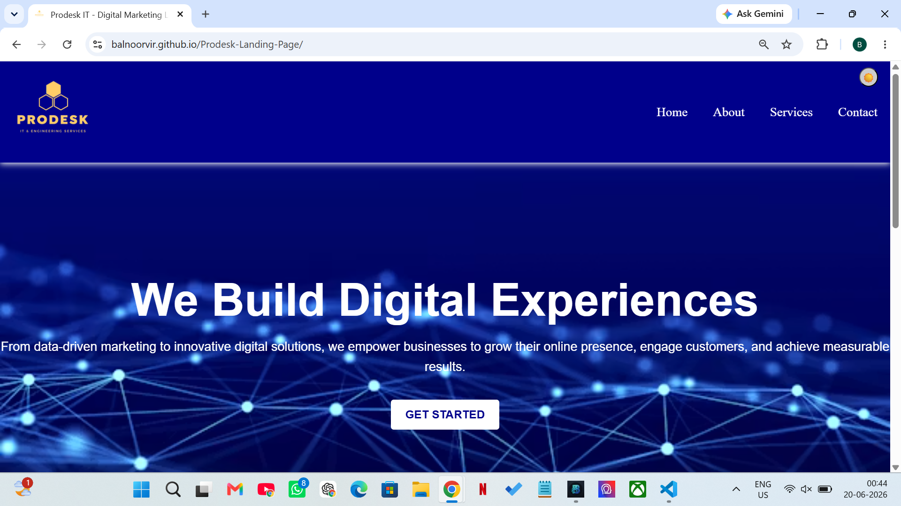
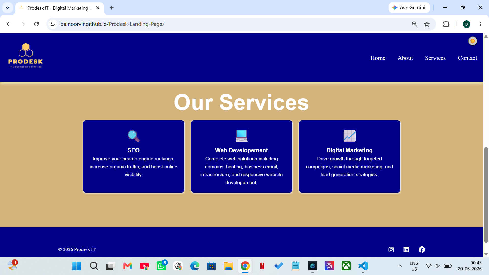

# Prodesk-Landing-Page
## Project Overview
This is a responsive product landing page built as a part of my sprint project. It is designed using HTML, CSS and Javascript.

---
## Live Website
https://prodesk-landing-page-six.vercel.app/

## Screenshots
### Hero Section

### Services Section

## Features
- Responsive navigation bar with hamburger menu for mobile devices
- Dark/Light mode toggle for enhanced user experience
- Engaging hero section with call-to-action button
- Structured services section highlighting key features
- Responsive footer

##  Project Status
Phase 1 and Phase 2 completed.  
Phase 3 will include advanced enhancements.

##  Author
Created as a sprint project submission.
##  Note
This project is developed as part of my learning journey in web development.  
As a beginner, I focused on implementing core concepts like responsive design, navigation, dark/light mode, and layout structure.  

The project may continue to improve in future versions as I learn more advanced techniques.
